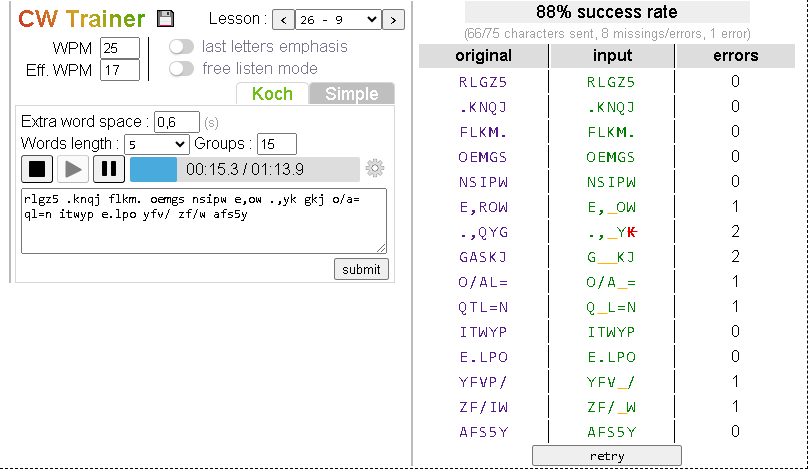

# CW-Trainer
Offline morse code (CW) trainer based on Koch method. Inspired by the great [LCWO.net](https://lcwo.net/)

The tool is available to use online :  [[cw-trainer]](https://spasutto.github.io/cw-trainer/cw-trainer.html)  . Save it for offline use by clicking on the "floppy" icon.

Just hit the "play" button and try to write the letters you copy. When the player stop  click "verify". If your score is > 90% you can go to the next lesson.
<p align="center">
  <a href="images/screenshot.png"></a>
</p>

## Use
You can use the tool [online](https://spasutto.github.io/cw-trainer/cw-trainer.html) or click on the floppy disk icon to save it on your disk or smartphone, then you're free to practice anywhere without GSM coverage.

Start with lesson 1, adjust the tonality to your hearing preference, set the WPM to a value between 20 and 25 Words per minute and the Effective speed somewhere between 10 and the WPM speed. Relax, concentrate on your keyboard/paper and hit the "play" button. Try to write the letters you copy, don't try to decode already sent ones, just write the current symbol. When the player stops click "verify" ; If your score is > 90% you can go to the next lesson.

If it's too hard you can decrease the "Eff. WPM" to whatever you want. You can also increase the "extra word spacing" : it's a time in seconds wich is added to the natural space between words

There are 40 lessons consisting in letters/symbols and 3 additional lessons :
 - Letters : only alphabet letters
 - QSO : chunks of sample QSO, with randomly generated callsigns, RST...
 - Free text : Randomly picked portions of Oliver Twist (Charles Dickens)

## Commands
 - <kbd>space</kbd> : pause ( <kbd>ctrl</kbd>-<kbd>space</kbd> if input has focus)
 - <kbd>left</kbd>/<kbd>right</kbd> : fast forward/rewind ( <kbd>ctrl</kbd>-<kbd>left</kbd>/<kbd>right</kbd> if input has focus)
 - **right click on  play** (long click on touch devices) to activate "Automatic start"
 - **double click on app's name** to display symbols currently being played

## Reuse

The `CWPlayer` and `MorsePlayer` classes (defined in [morseplayer.js](morseplayer.js)) can be reused :

### CWPlayer
More infos [here](cwplayer.md) & samples [here](https://spasutto.github.io/cw-trainer/samples.html)
```HTML
  <script src="morseplayer.js"></script>
  <textarea id="cwtext" rows="4" cols="43" spellcheck="false">CQ CQ CQ DE F8XYZ K</textarea><br>
  <input type="button" onclick="player.play(cwtext.value)" value="play">
  <input type="button" onclick="player.pause()" value="pause">
  <input type="button" onclick="player.stop()" value="stop">
  <input type="button" onclick="player.WPM = 15" value="15 WPM">
  <input type="button" onclick="player.WPM = 25" value="25 WPM">
  <input type="button" onclick="player.EffWPM = 15" value="Eff 15 WPM">
  <input type="button" onclick="player.EffWPM = 25" value="Eff 25 WPM">
  <input type="button" onclick="player.Tone = 700" value="700 Hz">
  <input type="button" onclick="player.Tone = 1500" value="1500 Hz">
  <script>
    var player = new CWPlayer();
    //  or specify options
    //var player = new CWPlayer({'wpm': 25, 'effwpm': 12, 'tone': 1200});

    // Utility function (static)
    var translated = CWPlayer.translate("Bonjour");
    console.log(translated);
    // '-... --- -. .--- --- ..- .-.'

    // Input text is cleaned : 
    player.Text = "StrÀngé ïnpùt tèxt";
    console.log(player.Text);
    // 'STRANGE INPUT TEXT'
  </script>
```

### MorsePlayer
More infos [here](morseplayer.md) & samples [here](https://spasutto.github.io/cw-trainer/samples.html)
```HTML
  <script src="morseplayer.js"></script>
  <style>
    #player2 {
      width: 380px;
    }
  </style>
  <morse-player id="player1" text="cq cq cq de F8XYZ" displayprogressbar="false" predelay="2"></morse-player>
  <morse-player id="player2" displayclearzone="true">this text is played in morse</morse-player>
  <morse-player id="player3" wpm="25" effwpm="17" tone="1000">this also</morse-player>
```
