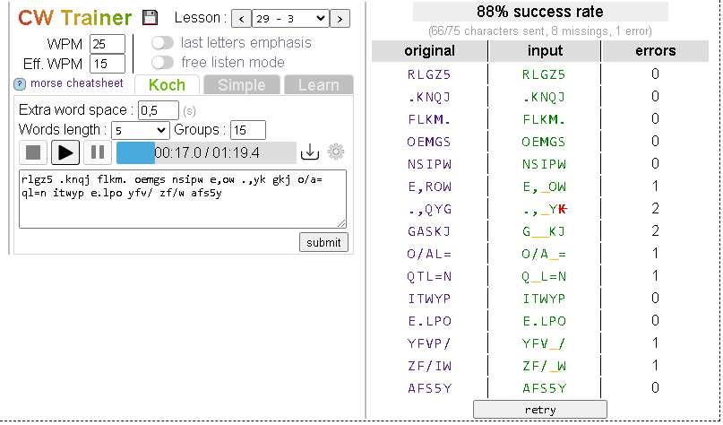

# CW-Trainer
Offline morse code (CW) trainer based on Koch method. Inspired by the great [LCWO.net](https://lcwo.net/)

The tool is available to use online :  [[cw-trainer]](https://spasutto.github.io/cw-trainer/cw-trainer.html)  . Save it for offline use by clicking on the "floppy" icon.

Just hit the "play" button and try to write the letters you copy. When the player stop  click "verify". If your score is > 90% you can go to the next lesson.
<p align="center">
  <a href="images/screenshot.png"></a>
</p>

## Use
Just copy [cw-trainer.html](cw-trainer.html) on your disk or your smartphone and you're free to practice anywhere without GSM coverage
## Reuse
The `CWPlayer` class (defined at the bottom of [cw-trainer.html](cw-trainer.html)) can be reused :

```HTML
  <textarea id="cwtext" rows="4" cols="43" spellcheck="false">CQ CQ CQ DE F8XYZ AR</textarea><br>
  <input type="button" onclick="player.play(cwtext.value)" value="play">
  <input type="button" onclick="player.pause()" value="pause">
  <input type="button" onclick="player.stop()" value="stop">
  <input type="button" onclick="player.WPM = 15" value="15 WPM">
  <input type="button" onclick="player.WPM = 25" value="25 WPM">
  <input type="button" onclick="player.EffWPM = 15" value="Eff 15 WPM">
  <input type="button" onclick="player.EffWPM = 25" value="Eff 25 WPM">
  <input type="button" onclick="player.Tone = 700" value="700 Hz">
  <input type="button" onclick="player.Tone = 1500" value="1500 Hz">
  <script>
    /* replace this comment by the CWPlayer class taken from cw-trainer.html */
    /* or insert the script as external JS file */
    var player = new CWPlayer();
    //  or specify options
    //var player = new CWPlayer({'wpm': 25, 'effwpm': 12, 'tone': 1200});

    // Utility function (static)
    var translated = CWPlayer.translate("Bonjour");
    console.log(translated);
    // '-... --- -. .--- --- ..- .-.'

    // Input text is cleaned : 
    player.Text = "StrÀngé ïnpùt tèxt";
    console.log(player.Text);
    // 'STRANGE INPUT TEXT'
  </script>
```